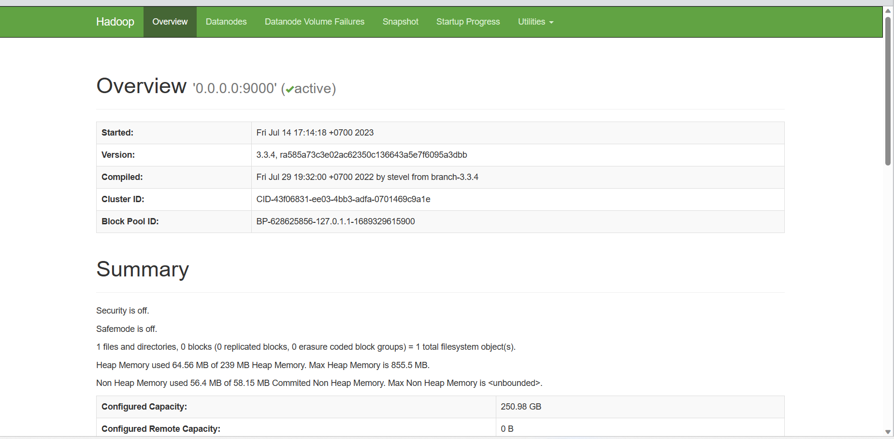

# Hadoop_Installation
I use Ubuntu 22.04 to have an ability to easily approach to Apache Hadoop in Linux OS.

## 0. Create new user:
### 0.1. Create group: 
    sudo groupadd ZeroX
### 0.2. Add user: 
    sudo useradd -md /home/ZeroX -s /bin/bash -g ZeroX ZeroX
### 0.3. Update password: 
    sudo su - 
    sudo paswd ZeroX
### 0.4. Update usermod:
    sudo usermod -aG sudo ZeroX
### 0.5. Access new user: 
    sudo su - ZeroX

## 1. Create Hadoop workspace
### 1.1. Install java environment: 
    sudo apt install openjdk-8-jdk
    java -version
### 1.2. Install Remote ssh: 
    sudo apt install openssh-server openssh-client -y
    ssh-keygen -t rsa
**Note**: sudo chmod 755 Folder (When having bug)

### 1.3. Download File install Hadoop: 
    wget https://dlcdn.apache.org/hadoop/common/hadoop-3.3.4/hadoop-3.3.4.tar.gz
### 1.4. Unzip file above
    tar -xvzf hadoop-3.3.4.tar.gz
### 1.5. Move it to /usr/local/hadoop
    sudo mv hadoop-3.3.4 /usr/local/hadoop
### 1.6. Create file logs
    sudo mkdir /usr/local/hadoop/logs
    sudo chown -R ZeroX:ZeroX /usr/local/hadoop
### 1.7. Append some information in ~/.bashrc 
    sudo nano ~/.bashrc
#### Append: 

    export HADOOP_HOME=/usr/local/hadoop

    export HADOOP_INSTALL=$HADOOP_HOME

    export HADOOP_MAPRED_HOME=$HADOOP_HOME

    export HADOOP_COMMON_HOME=$HADOOP_HOME

    export HADOOP_HDFS_HOME=$HADOOP_HOME

    export YARN_HOME=$HADOOP_HOME

    export HADOOP_COMMON_LIB_NATIVE_DIR=$HADOOP_HOME/lib/native

    export PATH=$PATH:$HADOOP_HOME/sbin:$HADOOP_HOME/bin

    export HADOOP_OPTS="-Djava.library.path=$HADOOP_HOME/lib/native"
#### Check 
    source ~/.bashrc
##### Find Java path
    which javac
##### Find OpenJDK directory
    readlink -f /usr/bin/javac
### 1.8. Edit hadoop-env.sh: 
    sudo nano $HADOOP_HOME/etc/hadoop/hadoop-env.sh
#### Append: 
    export JAVA_HOME=/usr/lib/jvm/java-11-openjdk-amd64
    export HADOOP_CLASSPATH+=" $HADOOP_HOME/lib/*.jar"
### 1.9. Browse to the hadoop lib directory
    cd /usr/local/hadoop/lib
### 1.10. Download the Javax activation file
    sudo wget https://jcenter.bintray.com/javax/activation/javax.activation-api/1.2.0/javax.activation-api-1.2.0.jar

## 2. Verify the Hadoop version
    sudo nano $HADOOP_HOME/etc/hadoop/core-site.xml
### Append: 
    <configuration>

    <property>

        <name>fs.default.name</name>

        <value>hdfs://0.0.0.0:9000</value>

        <description>The default file system URI</description>

    </property>

    </configuration>

### Create a directory for storing node metadata and change the ownership to ZeroX.
    sudo mkdir -p /home/ZeroX/hdfs/{namenode,datanode}
    sudo chown -R ZeroX:ZeroX /home/ZeroX/hdfs
### Edit hdfs-site.xml configuration file to define the location for storing node metadata, fs-image file.
    sudo nano $HADOOP_HOME/etc/hadoop/hdfs-site.xml
#### Append:
    <configuration>

        <property>

            <name>dfs.replication</name>

            <value>1</value>

        </property>

        <property>

        <name>dfs.name.dir</name>

        <value>file:///home/ZeroX/hdfs/namenode</value>

        </property>

        <property>

            <name>dfs.data.dir</name>

            <value>file:///home/ZeroX/hdfs/datanode</value>

        </property>

    </configuration>

### Edit mapred-site.xml configuration file to define MapReduce values.
    sudo nano $HADOOP_HOME/etc/hadoop/mapred-site.xml
#### Append:
    <configuration>

    <property>

        <name>mapreduce.framework.name</name>

        <value>yarn</value>

    </property>

    </configuration>
### Edit the yarn-site.xml configuration file and define YARN-related settings.
    sudo nano $HADOOP_HOME/etc/hadoop/yarn-site.xml
#### Append: 
    <configuration>

    <property>

        <name>yarn.nodemanager.aux-services</name>

        <value>mapreduce_shuffle</value>

    </property>

    </configuration>
## 3. Run Hadoop
### Validate the Hadoop configuration and format the HDFS NameNode.
    hdfs namenode -format
### Start the Apache Hadoop Cluster
    start-all.sh
    jps
### => Successful Installation Process

### Access Apache Hadoop Web Interface
http://localhost:9870/dfshealth.html#tab-overview
