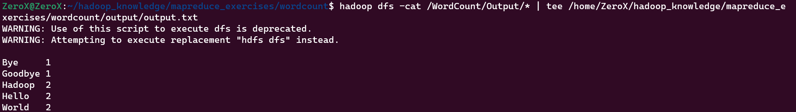

# MapReduce_Process
All step about how to run the MapReduce program in Hadoop. 
=> Using a basic example WordCount.

## 1. Basic interaction with hadoop
### 1.1. Remove file in hadoop: 
hadoop fs -rm -r /WordCount
### 1.2. Rename varible HADOOP_CLASSPATH in terminal
    export HADOOP_CLASSPATH=$(hadoop classpath)
#### =>Check again:  
    echo $HADOOP_CLASSPATH
### 1.3. Create a directory in hadoop: 
    hadoop fs -mkdir /WordCount
    hadoop fs -mkdir /WordCount/Input
### 1.4. Put file into a directory in hadoop: 
    hadoop fs -put '/home/ZeroX/hadoop_knowledge/mapreduce_exercises/wordcount/input/wordcount.txt' /WordCount/Input 

## 2. Run MapReduce program
### 2.1. Compile Java code: 
    javac -cp ${HADOOP_CLASSPATH} -d '/home/ZeroX/hadoop_knowledge/mapreduce_exercises/wordcount/classes' '/home/ZeroX/hadoop_knowledge/mapreduce_exercises/wordcount/WordCount.java'

**Note:** sudo chmod 777 classes 

### 2.2. Create file.jar: 
    jar -cvf WordCount.jar -C classes/ .
**Note:** sudo chmod 777 wordcount 

### 2.3. Run file.jar in hadoop with input
    hadoop jar '/home/ZeroX/hadoop_knowledge/mapreduce_exercises/wordcount/WordCount.jar' WordCount /WordCount/Input /WordCount/Output
### 2.4. Result of MapReduce Program: 
    hadoop dfs -cat /WordCount/Output/* | tee /home/ZeroX/hadoop_knowledge/mapreduce_exercises/wordcount/output/output.txt
